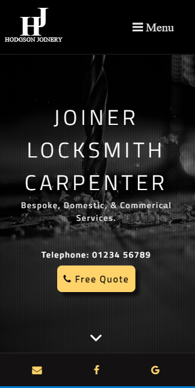
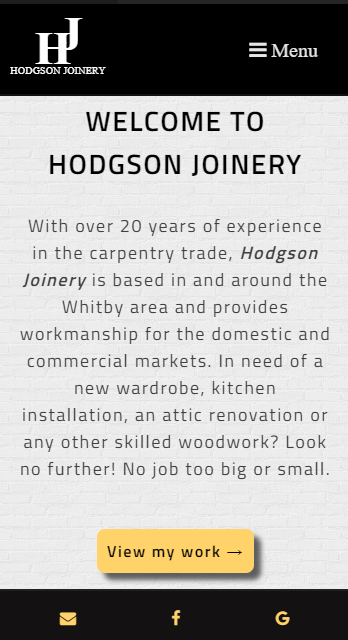

# hodgsonjoinery

Personal project - website for my dad's joinery and locksmith business

Aim is fully responsive website, starting with mobile first.

Using:

* HTML
* CSS
* JavaScript

View Deployment from GitHub [here](https://foxystoat.github.io/hodgsonjoinery/)

### Screenshots of Website so far:

